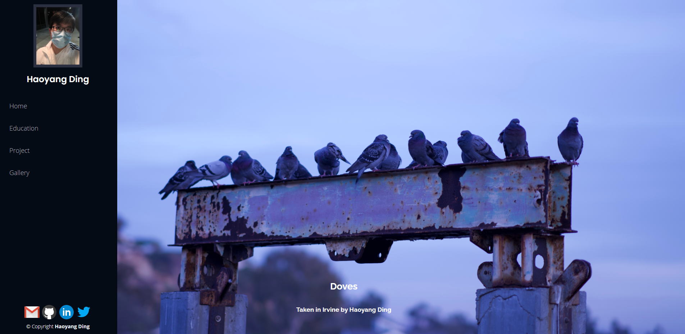

# Haoyang Ding's Homepage
* Author: <a href="https://github.com/KKDJOSEPH">Haoyang Ding</a> 
* <a href="https://johnguerra.co/classes/webDevelopment_spring_2021/">CS 5610 Web Development Northeastern University</a> 
* Description: A self-designed homepage, using Html, Css, JavaScript, contact information included, Bootstrap, ESlint used, without any Template
 

# Project basic information
- CS 5610 Project 1
- Project Objective: Develop my home page. Practice things learned from class
- <a href="https://johnguerra.co/classes/webDevelopment_spring_2021/"> Class Link </a>
- <a href="https://johnguerra.co/"> Professor: John Alexis Guerra Gómez </a>
- <a href="https://kkdjoseph.github.io/Home_Page.github.io/index.html"> Here to Enjoy </a>
- <a href="https://www.youtube.com/watch?v=TEDns9n2nkA&feature=youtu.be"> Demo Video </a>

# Technologies
- HTML
- CSS
- JavaScript
- Bootstrap
- ESLint

# Instructions
- Main files:
  * index.html
  * Education.html
  * Project.html
  * Gallery.html
  
- Main folder:
  * assests
    - css: Three css files for different pages
    - gallery: Photos taken in Irvine
    - images: Images used for icon and background
    - js: main javascript file for the gallery

- Instruction to build:
  * Fork the repository
  * Clone the repository, make sure you already got node.js
  * Double click on index.html
  * Enjoy
  
- References:
  * <a href=https://getbootstrap.com/docs/4.0/layout/overview/>Bootstrap Containers</a> 
  * <a href=https://developer.mozilla.org/en-US/docs/Learn/Getting_started_with_the_web/>MDN</a> 

    

